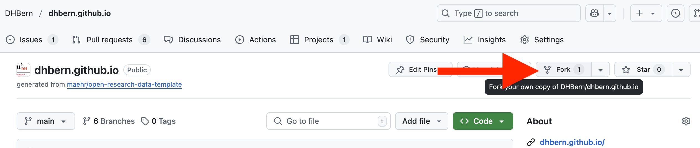
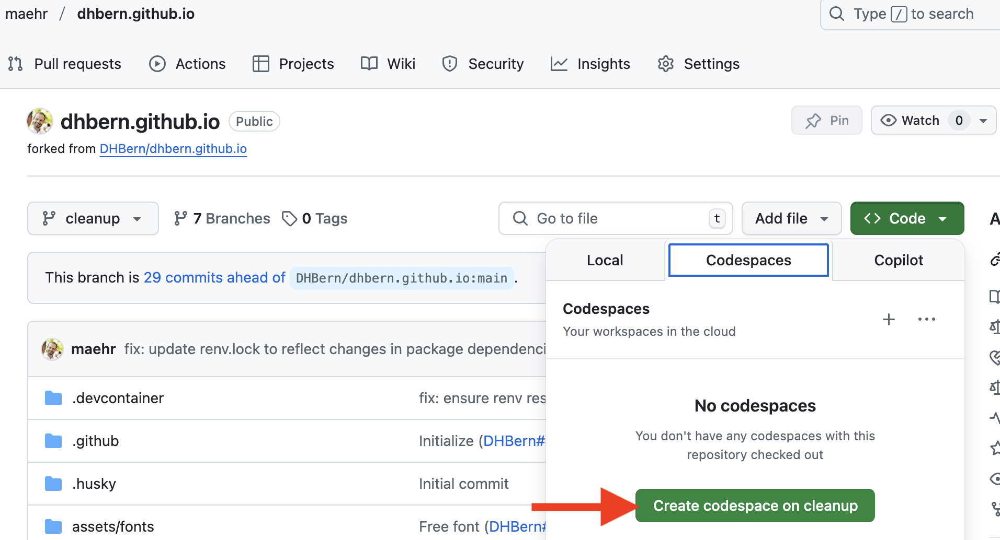
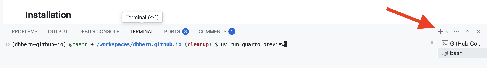

# stadt-geschichte-basel.github.io

This repository contains the documentation of the work of the team for research data management and digital education of Stadt.Geschichte.Basel.

[](https://github.com/Stadt-Geschichte-Basel/stadt-geschichte-basel.github.io/issues)
[](https://github.com/Stadt-Geschichte-Basel/stadt-geschichte-basel.github.io/network)
[](https://github.com/Stadt-Geschichte-Basel/stadt-geschichte-basel.github.io/stargazers)
[](https://github.com/Stadt-Geschichte-Basel/stadt-geschichte-basel.github.io/blob/main/LICENSE-AGPL.md)
[](https://github.com/Stadt-Geschichte-Basel/stadt-geschichte-basel.github.io/blob/main/LICENSE-CCBY.md)
[](https://zenodo.org/badge/latestdoi/ZENODO_RECORD)

## Repository Structure

The structure of this repository follows the [Advanced Structure for Data Analysis](https://the-turing-way.netlify.app/project-design/project-repo/project-repo-advanced.html) of _The Turing Way_ and is organized as follows:

- `assets/`: Images, figures, and other media files.
- `docs/`: Documentation files, including the main README and other markdown files.
- `products/`: The final products of the project, such as reports, papers, or presentations.
- `renv/`: The R environment for the project, including package dependencies and versions.

## Getting Started

We recommend using **GitHub Codespaces** for the easiest and fastest setup. It gives you a pre-configured, cloud-based development environment with everything ready to go — directly in your browser.

### 🚀 Quick Start with GitHub Codespaces

1. **Fork this repository** to your GitHub account (if needed).

<div align="center">
  
</div>

2. Click the green **`<> Code`** button at the top right of this repository.

3. Select the **“Codespaces”** tab and click **“Create codespace on `main`”**.

<div align="center">
  
</div>

4. GitHub will now build a container that includes:
   - ✅ Node.js (via `npm`)
   - ✅ Python with `uv`
   - ✅ R with `renv`
   - ✅ Quarto

5. Once the Codespace is ready, you can preview the documentation locally inside the Codespace with:
   - **Open a terminal** in the Codespace (Terminal > New Terminal).
   - **Run the following command** to install all dependencies and preview the project:

```bash
uv run quarto preview
```

<div align="center">
  
</div>

---

### 🛠️ Local Setup

<details>
<summary>👩‍💻 Recommended for advanced users</summary>

### Prerequisites

Make sure the following tools are installed locally:

- [Node.js](https://nodejs.org/en/download/)
- [R](https://cran.r-project.org/) and Rtools (on Windows)
- [uv (Python manager)](https://github.com/astral-sh/uv#installation)
- [Quarto](https://quarto.org/docs/get-started/)

> _Note: `uv` automatically manages a Python version if none is installed._

### Local setup steps

```bash
# 1. Install Node.js dependencies
npm install

# 2. Setup Python environment
uv sync

# 3. Setup R environment
Rscript -e 'install.packages("renv"); renv::restore()'

# 4. Preview documentation
uv run quarto preview
```

</details>

## Use

Check that all files are properly formatted.

```bash
npm run check
```

Format all files.

```bash
npm run format
```

Run the wizard to write meaningful commit messages.

```bash
npm run commit
```

Run the wizard to create a CHANGELOG.md.

```bash
npm run changelog
```

Preview the documentation.

```bash
uv run quarto preview
```

## Support

This project is maintained by [@Stadt-Geschichte-Basel](https://github.com/Stadt-Geschichte-Basel). Please understand that we can't provide individual support via email. We also believe that help is much more valuable when it's shared publicly, so more people can benefit from it.

| Type                                   | Platforms                                                                                                    |
| -------------------------------------- | ------------------------------------------------------------------------------------------------------------ |
| 🚨 **Bug Reports**                     | [GitHub Issue Tracker](https://github.com/Stadt-Geschichte-Basel/stadt-geschichte-basel.github.io/issues)    |
| 📊 **Report bad data**                 | [GitHub Issue Tracker](https://github.com/Stadt-Geschichte-Basel/stadt-geschichte-basel.github.io/issues)    |
| 📚 **Docs Issue**                      | [GitHub Issue Tracker](https://github.com/Stadt-Geschichte-Basel/stadt-geschichte-basel.github.io/issues)    |
| 🎁 **Feature Requests**                | [GitHub Issue Tracker](https://github.com/Stadt-Geschichte-Basel/stadt-geschichte-basel.github.io/issues)    |
| 🛡 **Report a security vulnerability** | See [SECURITY.md](SECURITY.md)                                                                               |
| 💬 **General Questions**               | [GitHub Discussions](https://github.com/Stadt-Geschichte-Basel/stadt-geschichte-basel.github.io/discussions) |

## Roadmap

See <https://github.com/orgs/Stadt-Geschichte-Basel/projects/5> for the current roadmap.

## Contributing

All contributions to this repository are welcome! If you find errors or problems with the data, or if you want to add new data or features, please open an issue or pull request. Please read [CONTRIBUTING.md](CONTRIBUTING.md) for details on our code of conduct and the process for submitting pull requests.

## Versioning

We use [SemVer](http://semver.org/) for versioning. The available versions are listed in the [tags on this repository](https://github.com/Stadt-Geschichte-Basel/stadt-geschichte-basel.github.io/tags).

## Authors and acknowledgment

- **Stadt.Geschichte.Basel** - [Stadt-Geschichte-Basel](https://github.com/Stadt-Geschichte-Basel)
- **Moritz Mähr** - [maehr](https://github.com/maehr)
- **Moritz Twente** - [mtwente](https://github.com/mtwente)

See also the list of [contributors](https://github.com/Stadt-Geschichte-Basel/stadt-geschichte-basel.github.io/graphs/contributors) who contributed to this project.

## License

The data in this repository is released under the Creative Commons Attribution 4.0 International (CC BY 4.0) License - see the [LICENSE-CCBY](LICENSE-CCBY.md) file for details. By using this data, you agree to give appropriate credit to the original author(s) and to indicate if any modifications have been made.

The code in this repository is released under the GNU Affero General Public License v3.0 - see the [LICENSE-AGPL](LICENSE-AGPL.md) file for details. By using this code, you agree to make any modifications available under the same license.
